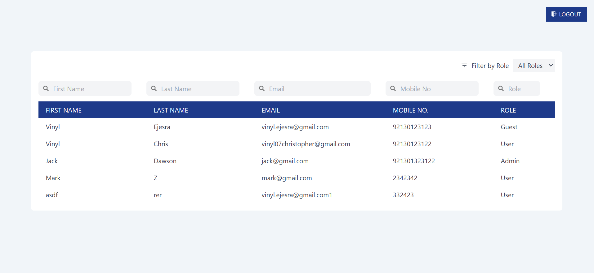
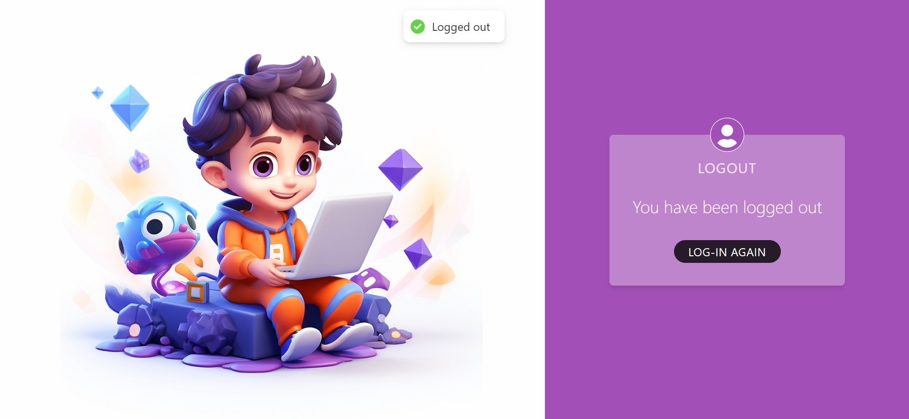

# USER MANAGER
A project to register, login and display users and perform search functions.

## Project Screenshots & ENV variables

### Signup Page

### Login Page

### User List

### Logout Page

 
### FRONTEND ENV Variables
VITE_APP_API_URL=http://localhost:4000/api
 
### BACKEND ENV Variables
PORT=4000 
MONGO_URI = mongodb://localhost:27017/user-manager 
JWT_SECRET_KEY = "cXC9G9pW8hrt0HihzJ7AHLcJ7yMhLi"
