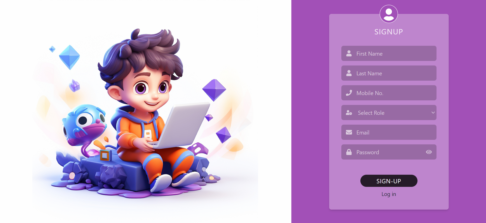
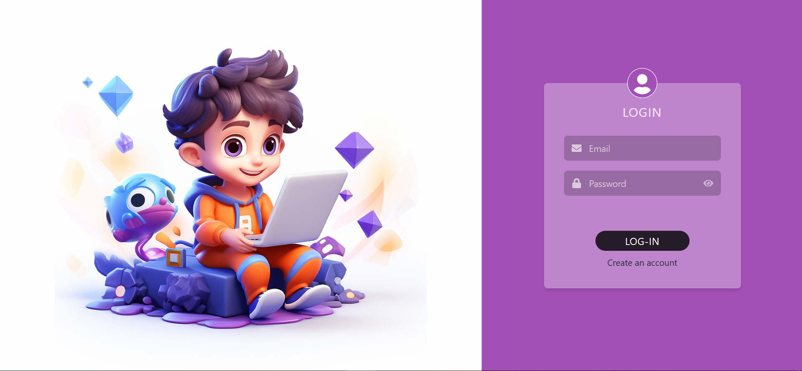

# SNS-iHub-assessment
SNS-iHub-assessment task

## Project Screenshots & ENV variables

### Signup Page

### Login Page

### User List

### Logout Page

 
### FRONTEND ENV Variables
VITE_APP_API_URL=http://localhost:4000/api
 
### BACKEND ENV Variables
!PORT=4000
!MONGO_URI = mongodb://localhost:27017/sns-ihub
!JWT_SECRET_KEY = "cXC9G9pW8hrt0HihzJ7AHLcJ7yMhLi"
